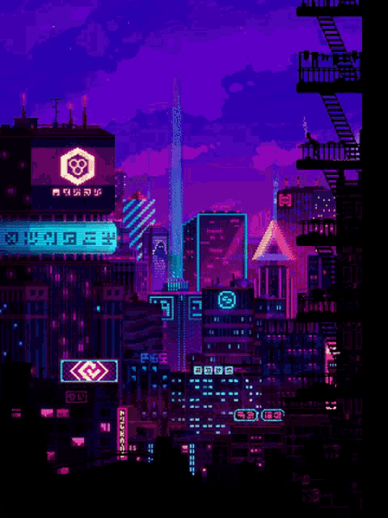

 

  

<h2></h2>

<h2 align="center"> Self-taught and passionate about coding! </h2> 

* 👨‍💻 I'm Akash(akash4-sys)👋, a college student, I'm currently pursuing a Computer Science Degree in the India.    

* 🌳 I’m currently learning TypeScript, Docker, Kubernetes and Microservices!    

* 🾠I’m looking to network and make friends here!    

* 🌊 2023 Goals: Improve Competitive Programming rating and Contribute to Open Source Projects.    

* ☕ Interest: Development, Math, Competitive Programming, Anime and Web Novel.    

<h2></h2>

  <h2> <strong> Education </strong>  </h2> 
  
  
  
  
  
  

 

<h2></h2>

  
  <h2> <strong> Technologies and Skills </strong></h2> 
    
  <h3> <strong> Actively Learning </strong></h3>
     
  <h3> <strong> Planning to Learn </strong></h3>
  

 

<h2></h2>
  

  <h2> <strong> My Github Stats </strong> </h2> 
    <h2></h2> 
  
  

  

